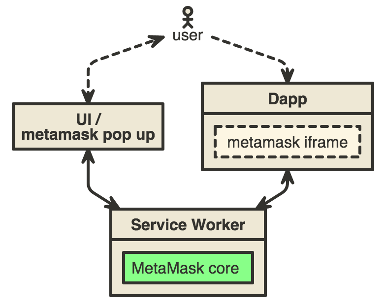

# [DO NOT USE YET THIS IS A WIP]
# MetaMascara

MetaMascara(mascara) brings metamask when metamask is not installed.

## Disclaimer:

MetaMascar is in alpha expect breaking changes

## How does it work and how to use it:

Mascara is an iframe that acts as a proxy between your dapp and metamask core.
The metamask core is the global context housed in a service worker, it does the
key management for every dapp the user visits.



to use as a CDN put this script tag in the `<head>` of your html file:

```html
<script src="https://zero.metamask.io/metamascara.js"></script>
```

or bring your own:

`npm i --save metamascara`

```js
const metamask = require('metamascara')
const EthJs = require('ethjs')

// mascara will use the environmental provider if the user brings one
// in the form of metamask extension, mist or parity
// other wise it will make one for you :}

const ethereumProvider = metamask.createDefaultProvider()

const eth = new EthJs(ethereumProvider)

// do stuff...
```

## Developing:

For development with metamask-extension/mascara to point the iframe at localhost just do:
```js
const metamask = require('metamascara')
const ethereumProvider = metamask.createDefaultProvider({
    host: 'http://localhost:9001'
  }) // or what ever port you use
```
